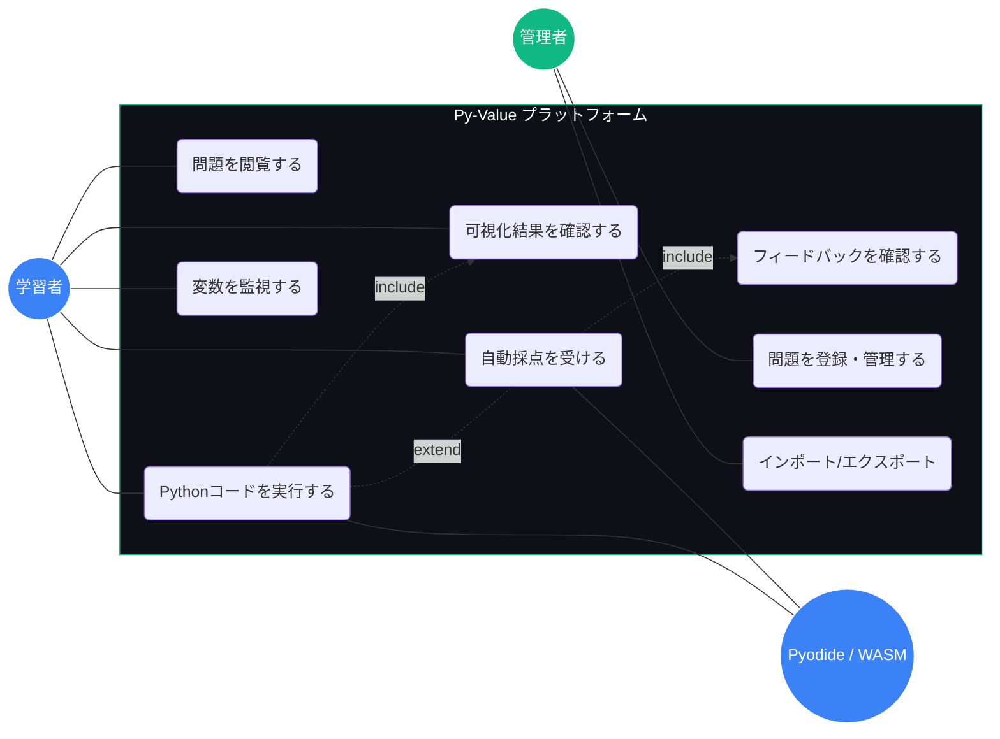
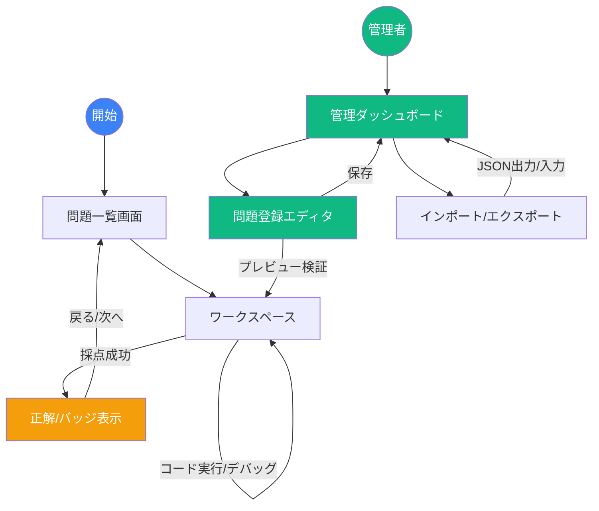

# Py-Value 製品要件定義書 (MVP版)

## 1. プロジェクト概要
* **製品名**: Py-Value（パイ・バリュー）
* **コンセプト**: 「統計検定の計算問題を、本物のコードで解く」ブラウザ完結型学習プラットフォーム。
* **ターゲット**: 統計検定受験者、データサイエンス初学者、環境構築に制限がある企業内研修生。

---

## 2. 技術スタック
* **実行エンジン**: Pyodide (Python 3.11+ / WebAssembly)
* **コードエディタ**: Monaco Editor (VS Code Core)
* **主要ライブラリ**: Pandas, NumPy, Matplotlib, SciPy, Statsmodels, Scikit-learn
* **UIフレームワーク**: Tailwind CSS, Vanilla JavaScript
* **Backend**: Node.js (Express)
* **Database (Local)**: Lowdb (JSONベース) ※将来的に Firebase (Firestore) へ移行

---

## 3. 機能要件

### 3.1 学習機能
* **Jupyterライクなセル**: セル間での状態保持、`Shift + Enter` 実行。
* **統計学習支援**: CSV等の仮想FSへの自動配備、MatplotlibのDOM即時投影。
* **変数監視**: 特定の重要変数（`ans` 等）をサイドパネルでトラッキング。
* **判定ロジック**: WASMサンドボックス内での非表示スクリプトによる自動採点。
* **実行制御**: コード実行の中断（Interrupt）およびカーネルリセット機能。

### 3.2 管理・システム機能
* **問題登録エディタ**: 管理者がGUI上で問題文、初期コード、採点ロジック、データセットを登録・編集できる画面。
* **インポート・エクスポート**: 問題データをJSONファイル形式で一括書き出し、および読み込み。
* **Web API通信**: フロントエンドとバックエンド間のデータ授受はすべてREST APIを介して行う。
* **DB抽象化**: リポジトリパターンを採用し、ServiceレイヤーからDB操作を隠蔽。LowdbとFirebaseを透過的に切り替え可能とする。

---

## 4. UI/UX 設計方針
* **カラー**: ダークテーマ (`#0d1117`) ＋ エメラルド・テックブルー。
* **レイアウト**: 3ペイン（問題 / エディタ / 可視化・ステータス）。
* **フィードバック**: 4次元幾何学ローディング、正解時のゲーミフィケーションバッジ。

---

## 5. 自動採点アルゴリズム

### A. 数値計算・統計検定（NumPy, SciPy, Pandas, Statsmodels）
* **基本判定**: 原則として変数 `ans` の値を検証。
* **近傍判定**: 浮動小数点誤差を考慮し、`math.isclose()` 等で判定（atol: $1e-5$, rtol: $1e-3$）。
* **複合問題の検証**: 難易度が高い問題では、中間変数（`p_value`, `std_error` 等）の妥当性もチェックし、段階的なフィードバックを行う。

### B. Matplotlib 解析ロジック
* **データ構造検証**: `Axes` オブジェクトからプロットされた数値配列を抽出し、期待値との相関（$r > 0.99$）を確認。
* **スタイル不問**: 凡例・色・ラベル等の見た目は、指定がない限り採点対象外とする。

### C. 機械学習相対評価
* **評価指標**: 検証データに対する Accuracy 等をパーセンテージで表示。
* **ベースライン比較**: 単純な推測による「ベースライン精度」を参考値として提示し、そこからの向上幅を可視化。

---

## 6. 問題データ構造 (JSON Schema)
```json
{
  "id": "string (UUID)",
  "title": "string",
  "problem_statement": "string (Markdown)",
  "initial_code": "string",
  "explanation": "string (Markdown)",
  "dataset": {
    "file_name": "string",
    "url": "string"
  },
  "validation": {
    "method": "value_match | script | ml_test",
    "expected_value": "any",
    "tolerance": "number",
    "baseline_value": "number",
    "hidden_test_script": "string",
    "hint": "string"
  },
  "metadata": {
    "author_id": "string",
    "status": "draft | published",
    "created_at": "ISO8601"
  }
}
```

---

## 7. 拡張ロードマップ
* **Phase 2**: Markdown対応セルの実装。
* **Phase 3**: `localStorage` へのコード自動保存。
* **Phase 4**: 複数チャプター管理システムの実装およびFirebaseへの完全移行。

---

## 8. Py-Value ユースケース一覧

| ID | ユースケース名 | 概要 | 備考 |
|:---|:---|:---|:---|
| UC-01 | **統計問題を閲覧する** | 学習者が問題文とデータ構造を確認する。 | 3ペインの「問題ペイン」に表示。 |
| UC-02 | **Pythonコードを実行する** | Monaco Editorで記述したコードをWASM上で実行し結果を確認する。 | Shift + Enterでトリガー。 |
| UC-03 | **グラフ・可視化を確認する** | Matplotlib等で生成された図表をDOM上で確認する。 | 実行結果として即時投影。 |
| UC-04 | **変数をトラッキングする** | 特定の重要変数（`ans`, `p_value`等）の現在の値をサイドパネルで監視する。 | 変数監視パネルに反映。 |
| UC-05 | **自動採点を実行する** | 記述したコードの出力が判定ロジック（数値近傍判定等）を満たすか確認する。 | 非表示スクリプトで実行。 |
| UC-06 | **学習フィードバックを受け取る** | 採点結果に応じたバッジや、機械学習のベースライン比較を確認する。 | ゲーミフィケーション要素。 |
| UC-07 | **問題を登録・管理する** | 管理者がGUIを通じて問題データを作成・DBへ保存する。 | Admin Mode限定機能。 |
| UC-08 | **データのインポート/エクスポート** | 管理者がJSONファイルを用いて問題を一括登録・出力する。 | ポータビリティの確保。 |



---

## 9. 画面遷移図


### 9.1 学習者フロー
1. **問題一覧画面 (Problem List)**
   - 登録されている統計問題がカード形式で並ぶ。
   - 各問題のステータス（未着手 / 正解 / 再挑戦）を表示。
   - 問題を選択すると「ワークスペース」へ遷移。
2. **ワークスペース (Workspace / 3ペイン)**
   - メインの学習画面。問題閲覧、コード実行、採点フィードバックをループする。
   - 採点合格時、ゲーミフィケーションバッジを表示。
   - 次の問題、または一覧へ戻るナビゲーション。

### 9.2 管理者フロー
1. **管理ダッシュボード (Admin Dashboard)**
   - 登録済み問題のリストアップとステータス管理（下書き/公開）。
   - 新規作成ボタンからエディタへ遷移。
   - インポート / エクスポート機能へのアクセス。
2. **問題登録エディタ (Problem Editor)**
   - フォームベースの問題作成画面。
   - 入力中の内容を実際のワークスペース形式でプレビュー・動作検証可能。

