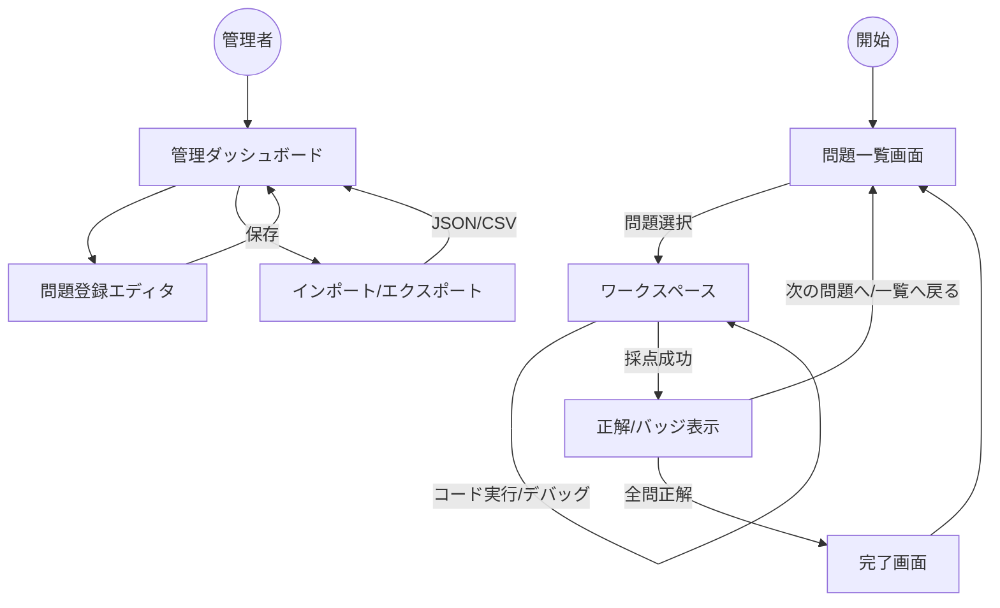

# REQ-01 問題集サイト枠組み 要件定義書

## 1. ドキュメント情報

| 項目 | 内容 |
|------|------|
| **ID** | REQ-01 |
| **スコープ** | 汎用問題集プラットフォームの基盤（枠組み）。学習者・管理者の画面、ルーティング、プラグイン契約、データソース抽象化、管理機能。 |
| **関連ドキュメント** | REQ-02（データ分析プラグイン）、後続の ARC-01, DATA-01, API-01, UX-01/02, TEST-01, INFRA-01 |

---

## 2. 目的・コンセプト

- **目的**: 「学習コンテンツ」と「システム基盤」を完全に分離し、Python データ分析、SQL、統計学など、あらゆる問題集に再利用可能な高拡張性プラットフォームを構築する。
- **コンセプト**: 1 URL = 1 ワークブック（問題集）。パスベースで複数問題集を切り替え可能。プラグイン方式で問題形式（コード、選択肢等）を拡張可能にする。

---

## 3. 用語定義

| 用語 | 定義 |
|------|------|
| ワークブック | 1 つの問題集。URL パス（例: `/py-value`）で一意に識別する。 |
| プラグイン | 問題の type に応じた表示・判定を提供するモジュール。表示用 React コンポーネントと判定アダプタから構成する。 |
| 問題 | 共通基底（id, title, type, 等）と type 別の拡張データを持つ。一意性はワークブック内で保証する。 |
| 下書き | 解答途中の状態。1 問題につき 1 件で保持し、明示的な操作で上書き保存する。 |
| 履歴 | 解答送信ごとの記録。匿名利用時は同一ブラウザのローカル識別子で紐づける。 |

---

## 4. アーキテクチャ方針

- **クリーンアーキテクチャ**: Service 層・Repository 層を分離し、データソース（Firebase / Lowdb）やロジックの変更に強い構造にする。
- **プラグイン方式**: 問題の `type` に応じてプラグインの Renderer（React コンポーネント）と判定アダプタを動的呼び出しする。複数 type を最初から想定し、ビルド時にコードで登録する。
- **マルチテナント**: パスベース（`/[workbookId]`）で複数の問題集を切り替える。MVP では `/py-value` のみを想定する。
- **環境分離**: 開発環境と本番環境を分離する。開発では Lowdb を利用可能とし、本番では Firebase（Firestore, Storage）を使用する。環境変数でデータソースを切り替える。

---

## 5. 技術スタック

- **Frontend**: Next.js (App Router), Tailwind CSS, TypeScript (Strict Mode)
- **本番**: Firebase（Firestore, Storage）。認証は MVP では不要（匿名利用を許可する）。
- **開発**: Lowdb（JSON ベース）。リポジトリパターンでデータソースを抽象化し、環境に応じて実装を切り替える。
- **State**: TanStack Query（Server State）、Web Worker（判定ロジックの呼び出し）

---

## 6. 機能要件

### 6.1 学習機能

- **動的ルーティング・パンくず**: URL パスから階層構造を自動生成する。
- **問題表示エンジン**: 問題の `type` に応じたプラグイン Renderer を動的呼び出しする。
- **問題一覧**: 登録順・難易度・タイトルでソート可能とする。デフォルトは登録順。問題が 0 件のときはその旨のメッセージを表示する。
- **解答フロー**:
  - 「開始」等によるセッション開始。
  - 「下書き保存」は明示クリックのみで行う（自動保存は MVP 外）。
  - 解答送信後、採点結果を即時表示する（1 問ずつ送信→即時表示。一括採点は MVP 外）。
- **判定**: Web Worker 経由でプラグインの判定アダプタを呼び出す（ブラウザ内で完結）。
- **履歴**: 解答履歴の一覧・詳細を必須とする。各問題につき直近 N 件まで保存する（N はデフォルト 10、管理画面で設定可能）。履歴件数上限のスコープは**ワークブック単位**とする。
- **バッジ**: 複数種類・条件を想定する。問題一覧の各カードにバッジを表示する。バッジはローカルで永続化する。
- **完了画面**: ワークブック内の全問題に正解した状態を認識し、完了画面を表示する（UC-F09）。

### 6.2 管理・運用機能

- **管理画面**: 問題の CRUD、JSON インポート/エクスポート、データセット（CSV）の別途インポートを行う。同一 Next アプリの別ルート（例: `/admin`）で提供する。アクセスは URL クエリの簡易キー（`?key=xxx`）で制御する。ロール（管理者/一般）は MVP では持たない。
- **問題ステータス**: 問題に「下書き」「公開」のステータスを持たせる。一覧には公開済みのみ表示する。管理画面でステータスを切り替える。
- **データセット（CSV）の登録**: データセットは管理画面からアップロードするか、所定の場所（開発時は例: `public/data/`）に配置する。問題データではファイル名またはパスで参照する。CSV を別途インポートする仕組みを用意する。
- **問題 JSON のインポート**: 1 件でもバリデーションエラーがあれば全体を拒否する。エクスポートは全問題を 1 ファイル（配列）とし、データセットは参照のみを含める。
- **i18n**: MVP では日本語のみとする。将来 Phase で他言語対応する。

---

## 7. プラグイン契約

枠組みがプラグインに求める契約を以下に定義する。REQ-02 をはじめとする各プラグインはこの契約に準拠する。

### 7.1 問題型とプラグインの対応

- 問題データは共通基底（id, title, type, category, difficulty, explanation, tags 等）と、`type` に応じた拡張フィールドを持つ。
- 枠組みは `type` に応じてレジストリからプラグインを取得し、表示と判定に利用する。

### 7.2 プラグインが提供するもの

- **表示用 React コンポーネント**: 枠組みが渡す props（問題データ、ユーザー解答、コールバック等）を受け取り、ワークスペース UI を描画する。
- **判定アダプタ（任意）**: コード実行・採点など、type 固有の判定が必要な場合、プラグインは `runJudge(question, userAnswer) => Promise<JudgeResult>` のようなインターフェースを実装したオブジェクトまたはモジュールを提供する。枠組みはこれを Web Worker 等から呼び出す。

### 7.3 枠組みが提供する API・コンテキスト

- ルーティング、問題・履歴の取得 API、下書き保存・解答送信のコールバック、および必要に応じてプラグインに渡すコンテキスト（workbookId, questionId 等）を提供する。

### 7.4 下書き・解答データの受け渡し

- 下書きおよび解答データの形式は、プラグイン契約で定めた共通の枠（例: 不明なフィールドは JSON で保持）に載せ、永続化・履歴は枠組みが行う。中身の解釈はプラグインが行う。

### 7.5 登録方法

- プラグインの登録はビルド時にコードで行う（例: `registerPlugin('python-analysis', Component, judgeAdapter)`）。複数 type を想定したレジストリとする。

---

## 8. 共通データ構造

- **問題の共通基底**: id（システム自動採番・UUID 等、ワークブック内で一意）, title, type, category, difficulty, explanation, tags, status（draft | published）等。詳細な型は DATA-01 に委ねる。
- **履歴**: workbookId, questionId, ユーザー識別子（匿名時はローカル識別子）, status（draft | submitted）, userAnswer, isCorrect, judgedAt 等。詳細は DATA-01 に委ねる。

---

## 9. ユースケース一覧（枠組み）

| ID | ユースケース名 | 概要 |
|----|----------------|------|
| UC-F01 | 問題一覧を閲覧する | 学習者がワークブック内の問題一覧・ステータス（バッジ含む）を確認する。ソート可能（登録順・難易度・タイトル）。 |
| UC-F02 | ワークスペース（問題）を開く | 一覧から問題を選び、該当プラグインのワークスペースへ遷移する。 |
| UC-F03 | 解答セッションを開始する | 「開始」等の操作で解答状態を開始する。 |
| UC-F04 | 下書きを保存する | 明示操作で解答途中の状態を 1 問題 1 件で上書き保存する。 |
| UC-F05 | 解答を送信し採点を依頼する | プラグインの判定結果を枠組みが受け取り、履歴に記録し、即時表示する。 |
| UC-F06 | 解答履歴を閲覧する | 自分の解答履歴一覧・詳細を見る。 |
| UC-F07 | （管理）問題を登録・編集・削除する | 管理画面で問題の CRUD、ステータス（下書き/公開）の切り替えを行う。 |
| UC-F08 | （管理）問題を JSON でインポート・エクスポートする | 問題データの一括取り込み・書き出し。データセットは参照のみ。CSV は別途インポートする。 |
| UC-F09 | ワークブック完了を確認する | ワークブック内の全問題に正解した状態で完了画面を表示する。 |

---

## 10. 画面・フロー

- **学習者**: 問題一覧 → ワークスペース → 採点・次の問題/一覧/完了画面。
- **管理者**: 管理ダッシュボード（簡易キーでアクセス）→ 問題 CRUD、インポート/エクスポート。

---

## 11. 非機能要件・制約

- **環境**: 開発/本番を分離。開発では Lowdb、本番では Firebase。リポジトリパターンで切り替え。
- **セキュリティ**: コード実行はサンドボックス（WASM/Web Worker）内で行う。管理画面は簡易キーで保護する。
- **パフォーマンス**: 数値目標は MVP では記載しない。Pyodide のロード等は 05_test / 06 で必要に応じて定義する。
- **アクセシビリティ**: HIG / Material Design / WCAG に沿う。具体は 04_ui_ux で定義する。
- **保守性**: プラグイン契約（React コンポーネント + 判定アダプタ）で拡張可能にし、React コンポーネントを差し替えるだけで別プラグインに切り替え可能とする。

---

## 12. ロードマップ（枠組み）

- **Phase 1**: 基盤の型定義、Layout、プラグインレジストリ、Repository（Lowdb/Firestore 抽象化）の作成。
- **Phase 2**: Firebase Service 層の実装、下書き保存・履歴保存。
- **Phase 3**: 履歴詳細画面、パンくず、i18n 対応。
- **Phase 4**: 複数ワークブック・複数プラグインの拡張。

---

## 13. MVP スコープ

**含める**: 認証なし（匿名利用）。管理画面（問題 CRUD、JSON インポート/エクスポート、CSV 別途インポート）。問題一覧・ワークスペース表示、ソート（登録順・難易度・タイトル）。データ分析プラグイン 1 本でのコード実行・採点（全セル結合）・変数監視・可視化。下書き保存（明示クリック）。解答送信と履歴（一覧・詳細必須）。各問題につき直近 N 件（デフォルト 10、管理画面で設定可能、ワークブック単位）。バッジ（複数種類・条件想定、問題一覧の各カードに表示、ローカル永続）。完了画面。開発は Lowdb＋シードを `public/data/` 等に配置。本番は Firebase（Storage でデータセット）。管理アクセスは URL クエリの簡易キー。

**含めない**: ログイン、i18n（日本語のみでよい）、自動保存、一括採点、対応ブラウザの明示、非機能の数値目標。
