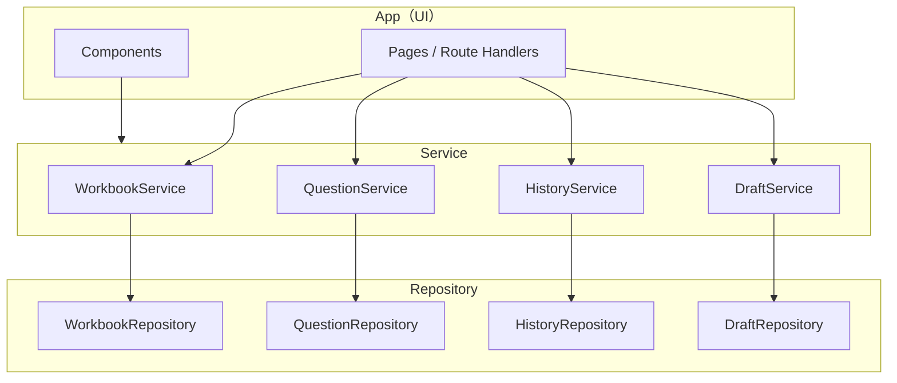
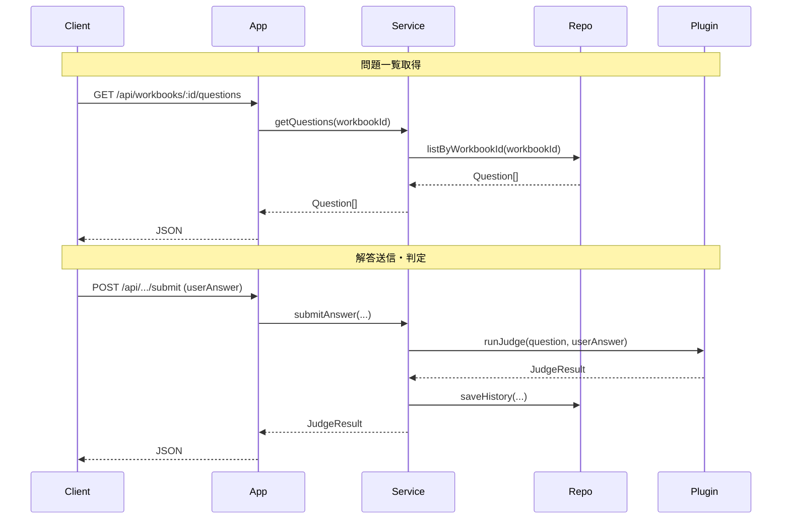

# ARC-01 システム設計書

## 1. ドキュメント情報

| 項目 | 内容 |
|------|------|
| **ID** | ARC-01 |
| **関連ドキュメント** | REQ-01（枠組み・プラグイン契約）、REQ-02（データ分析プラグイン）、DATA-01, API-01, ARC-02（プラグイン詳細） |

本ドキュメントは REQ-01 のクリーンアーキテクチャ・プラグイン方式を具体化する。スコープは MVP のみ。将来 Phase（認証、i18n、複数ワークブック等）は 1 節にまとめる。

---

## 2. ARC-01-001 レイヤー構成

クリーンアーキテクチャに従い、**App（UI）→ Service → Repository** の 3 層とする。依存は内側に向かう（Repository は Service に依存しない）。



- **App**: Next.js App Router のページ・Route Handlers、および React コンポーネント。Service を呼び出す。
- **Service**: ビジネスロジック。Repository のインターフェースに依存し、データソースの実装には依存しない。
- **Repository**: データの永続化・取得。インターフェースは共通、実装は環境に応じて Lowdb または Firestore に切り替える。

---

## 3. ARC-01-002 ディレクトリ構造

Next.js App Router と整合する構成。ソースコードはすべて **src/** 以下に配置する。

| パス | 役割 |
|------|------|
| **src/app/** | Next.js App Router。`[workbookId]/` で動的ルーティング（例: `/py-value`）。`admin/` で管理画面。 |
| **src/app/api/** | Route Handlers（API-01 の契約を実装）。 |
| **src/core/** | 枠組みの中核。Service・Repository のインターフェースと実装、プラグインレジストリ。 |
| **src/core/plugins/** | プラグインを 1 プラグイン 1 ディレクトリで配置。詳細は **ARC-02 参照**。 |
| **src/core/repositories/** | Repository 実装（Lowdb 用・Firestore 用）。 |
| **src/core/services/** | Service 実装。 |
| **src/lib/** | 共有ユーティリティ・型（DATA-01 の共有型を参照）。 |

例（MVP 想定）:

```
src/
  app/
    [workbookId]/          # 学習者向け（例: /py-value）
    admin/                 # 管理画面（?key=xxx）
    api/                   # Route Handlers
  core/
    plugins/
      python-analysis/     # データ分析プラグイン（ARC-02）
    repositories/
    services/
  lib/
```

---

## 4. ARC-01-003 プラグインレジストリ・配置方針

FR-F022 の具体化。

- **登録**: ビルド時にコードで行う。例: `registerPlugin('python-analysis', Component, judgeAdapter)`。複数 type を想定したレジストリとする。
- **取得**: 問題の `type` に応じてレジストリからプラグインを取得し、表示用コンポーネントと判定アダプタを利用する。
- **配置**: 1 プラグイン 1 ディレクトリ（例: `src/core/plugins/python-analysis/`）。コンポーネントは `index.tsx`、判定アダプタは `judge.ts` 等、ファイル名規則は **ARC-02** で定める。

プラグインの詳細なディレクトリ・コンポーネント構成は **ARC-02_plugin_python_analysis.md**（02_architecture/plugins/）を参照する。

---

## 5. ARC-01-004 データフロー

代表的なフローの概要を以下に示す。



- **問題一覧取得**: クライアント → Route Handler → QuestionService → QuestionRepository。公開済みのみ返す。
- **下書き保存**: クライアントが **X-Client-Id** ヘッダで識別子を送信。DraftService → DraftRepository で保存。
- **解答送信**: 枠組みがプラグインの判定アダプタを呼び出し（Web Worker 想定）、結果を HistoryRepository に保存。
- **管理画面**: クエリ `key` を検証したうえで、問題 CRUD・インポート/エクスポート・データセットアップロードを Route Handler 経由で実行。

---

## 6. ARC-01-005 環境別データソース切り替え

- **開発環境**: Lowdb（JSON ファイル）。Repository の実装を `repositories/lowdb/` 等に配置し、同じ型で JSON 化して永続化する。Firestore とスキーマ互換を保つ（DATA-01 参照）。
- **本番環境**: Firebase（Firestore, Storage）。Repository の実装を `repositories/firestore/` 等に配置する。
- **切り替え**: 環境変数でデータソースを指定し、DI またはファクトリで Repository 実装を注入する。設定・シークレットの管理は INFRA-01（reference.md）に記載する。

---

## 7. 将来 Phase（参考）

MVP 外の拡張として、以下を 1 節で記載する。

- 認証（匿名以外のユーザー識別）
- i18n（他言語対応）
- 複数ワークブックの横断・管理
- プラグインがサーバー API を持つ場合の API-02 拡張（03_contracts/plugins/ 参照）

---

## 8. 参照

- REQ-01 §4 アーキテクチャ方針、§5 技術スタック、§7 プラグイン契約
- DATA-01 共有型・Firestore スキーマ
- API-01 REST 契約（openapi.yaml が正本）
- ARC-02 データ分析プラグイン（02_architecture/plugins/）
