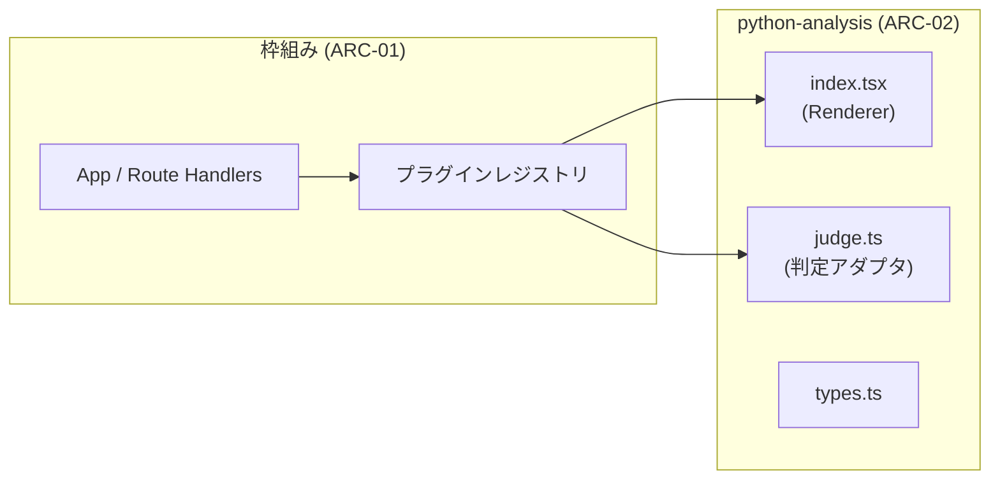
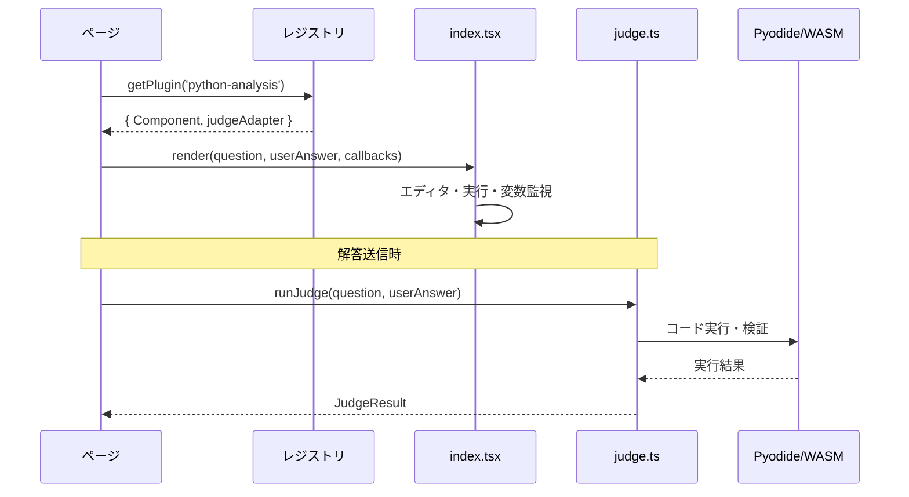

# ARC-02 データ分析プラグイン アーキテクチャ（EXER 第一版）

## 1. ドキュメント情報

| 項目 | 内容 |
|------|------|
| **ID** | ARC-02 |
| **プロジェクト名** | EXER |
| **関連ドキュメント** | REQ-02（データ分析プラグイン）、ARC-01（枠組み・プラグインレジストリ）、DATA-02（型・スキーマ） |

本ドキュメントはデータ分析プラグインのディレクトリ・コンポーネント構成を定義する。ARC-01 の「1 プラグイン 1 ディレクトリ」「プラグインは別ドキュメント参照」の具体である。

---

## 2. ディレクトリ構成

プラグインは **1 プラグイン 1 ディレクトリ**で配置する。データ分析プラグインは次のパスに配置する。

- **src/core/plugins/python-analysis/**

### 2.1 ファイル名規則

| ファイル | 役割 |
|----------|------|
| **index.tsx** | 表示用 React コンポーネント（Renderer）。枠組みが渡す props（問題データ、ユーザー解答、コールバック等）を受け取り、ワークスペース UI を描画する（FR-F018）。 |
| **judge.ts** | 判定アダプタ。`runJudge(question, userAnswer) => Promise<JudgeResult>` のようなインターフェースを実装し、枠組みが Web Worker 等から呼び出す（FR-F019）。 |
| **types.ts** | プラグイン内で利用する TypeScript 型（JudgeResult、問題拡張型等）。DATA-02 の型定義と整合させる。 |

その他、エディタ・実行エンジン・可視化用のサブモジュールは必要に応じて同一ディレクトリ内に配置してよい（例: `editor.tsx`, `runtime.ts`）。

---

## 3. コンポーネント・データフロー

枠組みは問題の `type` が `python-analysis` の場合、レジストリから本プラグインの Renderer（index.tsx）と判定アダプタ（judge.ts）を取得し、表示と採点に利用する。

- **Renderer**: 問題文、初期コード、データセット参照、変数監視対象を問題データから受け取り、3 ペイン（問題 / エディタ / 可視化・変数）を描画する。下書き保存・解答送信は枠組みのコールバック経由で行う。
- **判定アダプタ**: 全セル結合コードを Pyodide で実行し、validation に従って JudgeResult を返す。DATA-02 の JudgeResult 型・問題 JSON スキーマを参照する。

---

## 4. 参照

- REQ-02 データ分析プラグイン要件
- ARC-01 §4 プラグインレジストリ・配置方針（ARC-01-003）
- DATA-02 データ分析プラグイン用型・スキーマ（03_contracts/plugins/）
