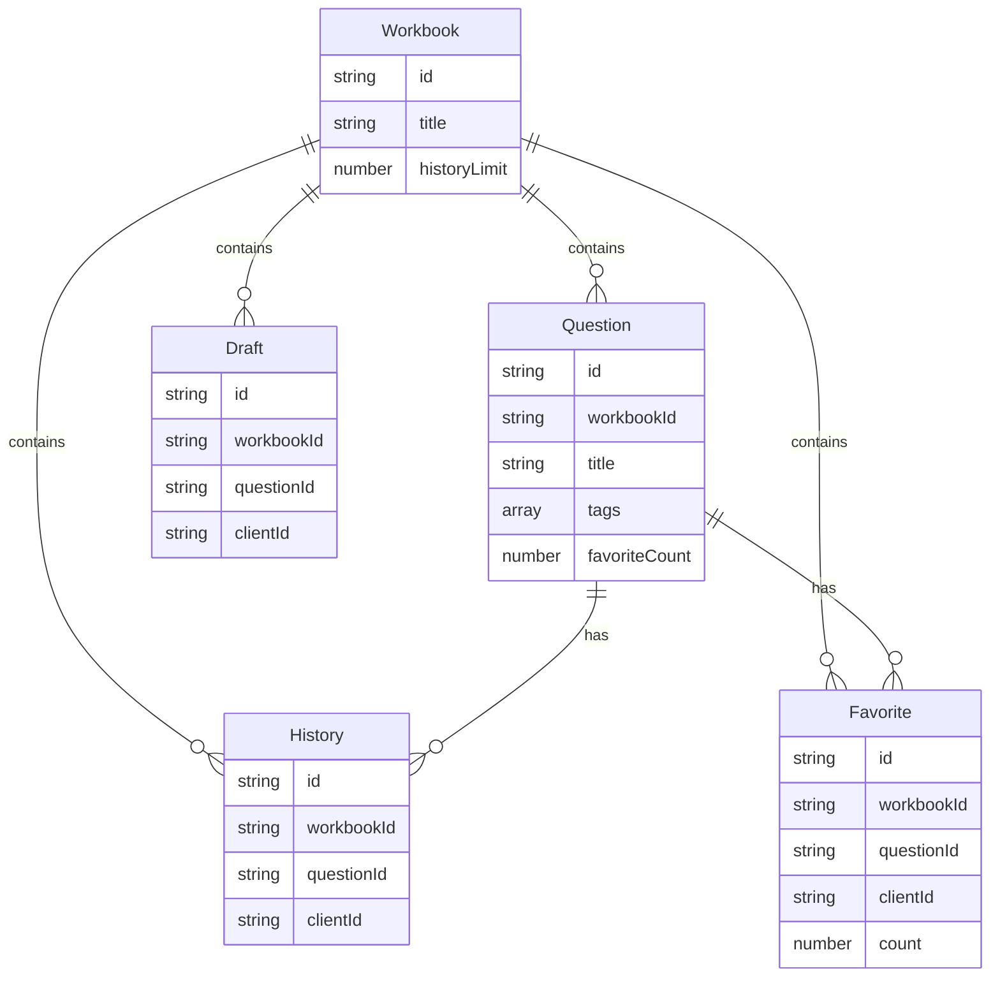

# DATA-01 共有型・スキーマ（EXER 第一版）

## 1. ドキュメント情報

| 項目 | 内容 |
|------|------|
| **ID** | DATA-01 |
| **プロジェクト名** | EXER |
| **関連ドキュメント** | REQ-01 §8 共通データ構造、ARC-01、API-01、DATA-02（プラグイン用拡張） |

本ドキュメントは枠組みで共有する型と Firestore/Lowdb のスキーマを定義する。プラグイン用の型・問題 JSON スキーマは **DATA-02**（03_contracts/plugins/）に委ねる。ワークブック ID の例として `py-value` を用いる場合、パンくず等の表示名は「Pythonデータ分析」とする（REQ-01 用語定義）。

---

## 2. 共有型定義（TypeScript）

REQ-01 §8 を満たす共有型を以下に定義する。

### 2.1 問題の共通基底（QuestionBase）

問題の共通基底。`type` に応じた拡張フィールドは同一オブジェクトに含めてよく、拡張のスキーマはプラグイン別 DATA-0x（例: DATA-02）を参照する。

```ts
// 問題ステータス
type QuestionStatus = 'draft' | 'published';

// 問題の共通基底（REQ-01 §8）
interface QuestionBase {
  id: string;           // ワークブック内で一意（UUID 等）
  title: string;
  type: string;          // 例: 'python-analysis' → プラグイン識別に使用
  category?: string;
  difficulty?: string;
  explanation?: string;  // 解説（Markdown 等）
  tags?: string[];
  status: QuestionStatus;
  order?: number;       // 登録順・ソート用
  favoriteCount?: number; // お気に入り数（集計値。API レスポンスで返す。denormalized または都度集計）
  createdAt?: string;   // ISO 8601
  updatedAt?: string;
}
```

- **Question**: `QuestionBase` に type 別の拡張フィールドを付与した型。拡張の定義は DATA-02 等を参照する。実装では `QuestionBase & Record<string, unknown>` やプラグイン別の交差型で表現してよい。一覧・詳細 API のレスポンスには `favoriteCount` を含める（REQ-01 FR-F027, FR-F028）。

### 2.2 ワークブック（Workbook）

1 つの問題集。URL パス（例: `/py-value`）で一意に識別する。表示名（パンくず等）はワークブックごとに設定可能（例: id `py-value` → 表示名「Pythonデータ分析」）。

```ts
interface Workbook {
  id: string;           // パスと一致（例: 'py-value'）
  title: string;
  description?: string;
  historyLimit?: number; // 各問題につき保存する履歴件数上限（デフォルト 10、ワークブック単位）
  createdAt?: string;
  updatedAt?: string;
}
```

- 履歴件数上限はワークブック単位で保持する（FR-F008）。

### 2.3 履歴（History）

解答送信ごとの記録。匿名利用時はクライアント識別子（X-Client-Id）で紐づける。

```ts
type HistoryStatus = 'draft' | 'submitted';

interface History {
  id: string;
  workbookId: string;
  questionId: string;
  clientId: string;     // 匿名識別子（X-Client-Id と対応）
  status: HistoryStatus;
  userAnswer: Record<string, unknown>; // プラグイン契約の枠に載せる（FR-F021）
  isCorrect?: boolean;  // 送信後のみ
  judgedAt?: string;   // ISO 8601
  createdAt: string;
  updatedAt?: string;
}
```

- `userAnswer` の中身の解釈はプラグインが行う。枠組みは永続化・履歴一覧のみを担当する。

### 2.4 下書き（Draft）

解答途中の状態。1 問題につき 1 件で保持し、明示的な操作で上書き保存する。

```ts
interface Draft {
  id: string;
  workbookId: string;
  questionId: string;
  clientId: string;     // 匿名識別子（X-Client-Id と対応）
  userAnswer: Record<string, unknown>;
  updatedAt: string;   // ISO 8601
}
```

### 2.5 お気に入り（Favorite）— MVP はモデル B

MVP では **1 ユーザー（clientId）・1 問題（workbookId + questionId）あたり 1 ドキュメントで `count` を保持**する。押下で count を +1、解除で -1（0 になったらドキュメント削除してよい）。問題ごとの「お気に入り数」は、その問題に対する全 Favorite の `count` の合計で表現する（実装では Question に denormalized で `favoriteCount` を持たせてもよい）。REQ-01 FR-F027 準拠。

```ts
interface Favorite {
  id: string;           // ドキュメント ID（workbookId + questionId + clientId の合成等で一意）
  workbookId: string;
  questionId: string;
  clientId: string;     // 匿名識別子（X-Client-Id と対応）
  count: number;        // 同一ユーザー・同一問題での押下回数。解除で -1。
  updatedAt: string;    // ISO 8601
}
```

- 一意制約: (workbookId, questionId, clientId) で 1 件。POST で追加時は既存があれば count+1、なければ新規作成（count=1）。DELETE で解除時は count-1、0 以下ならドキュメント削除。

---

## 3. Firestore スキーマ

本番環境では Firebase Firestore を使用する。コレクション名とドキュメントのフィールドを以下に定義する。

### 3.1 コレクション一覧

| コレクション | 役割 |
|--------------|------|
| **workbooks** | ワークブックのメタデータ（履歴上限設定等）を格納する。 |
| **questions** | 問題データ。**フラット**な 1 コレクションとし、ドキュメントに `workbookId` を持たせ、クエリで絞る。 |
| **histories** | 解答履歴。`workbookId` + `questionId` + `clientId` 等でクエリ。 |
| **drafts** | 下書き。`workbookId` + `questionId` + `clientId` で一意。 |
| **favorites** | お気に入り。`workbookId` + `questionId` + `clientId` で一意。1 ドキュメントあたり `count` を保持（MVP モデル B）。 |

### 3.2 workbooks

| フィールド | 型 | 説明 |
|------------|-----|------|
| id | string | ドキュメント ID。パスと一致（例: py-value）。 |
| title | string | タイトル |
| description | string | 任意 |
| historyLimit | number | 各問題の履歴件数上限（デフォルト 10） |
| createdAt | string | ISO 8601 |
| updatedAt | string | ISO 8601 |

### 3.3 questions（フラット）

**questions はフラット**なコレクションとする。ドキュメントに `workbookId` を持たせ、クエリでワークブックを絞る。共通基底フィールドと **type に応じた拡張フィールドを同一ドキュメントに含めてよい**。拡張のスキーマはプラグイン別 DATA-0x（例: DATA-02）を参照する。

| フィールド | 型 | 説明 |
|------------|-----|------|
| id | string | ワークブック内で一意 |
| workbookId | string | 所属ワークブック |
| title | string | 問題タイトル |
| type | string | プラグイン識別（例: python-analysis） |
| category | string | 任意 |
| difficulty | string | 任意 |
| explanation | string | 任意（Markdown 等） |
| tags | string[] | 任意 |
| status | 'draft' \| 'published' | 下書き / 公開 |
| order | number | 登録順・ソート用 |
| createdAt | string | ISO 8601 |
| updatedAt | string | ISO 8601 |
| favoriteCount | number | 任意。お気に入り数（denormalized の場合）。API レスポンスでは集計または本フィールドで返す。 |
| （拡張） | 各種 | type に応じたフィールド（DATA-02 等参照） |

### 3.4 favorites

| フィールド | 型 | 説明 |
|------------|-----|------|
| id | string | ドキュメント ID。（workbookId + questionId + clientId の合成等で一意） |
| workbookId | string | ワークブック ID |
| questionId | string | 問題 ID |
| clientId | string | 匿名識別子 |
| count | number | 同一ユーザー・同一問題での押下回数。追加で +1、解除で -1。 |
| updatedAt | string | ISO 8601 |

### 3.5 histories

| フィールド | 型 | 説明 |
|------------|-----|------|
| id | string | ドキュメント ID |
| workbookId | string | ワークブック ID |
| questionId | string | 問題 ID |
| clientId | string | 匿名識別子 |
| status | 'draft' \| 'submitted' | 送信済みは submitted |
| userAnswer | map | プラグイン契約の枠（JSON 互換） |
| isCorrect | boolean | 送信後のみ |
| judgedAt | string | ISO 8601 |
| createdAt | string | ISO 8601 |
| updatedAt | string | ISO 8601 |

### 3.6 drafts

| フィールド | 型 | 説明 |
|------------|-----|------|
| id | string | ドキュメント ID（workbookId + questionId + clientId の合成等） |
| workbookId | string | ワークブック ID |
| questionId | string | 問題 ID |
| clientId | string | 匿名識別子 |
| userAnswer | map | プラグイン契約の枠（JSON 互換） |
| updatedAt | string | ISO 8601 |

---

## 4. Lowdb 互換（開発環境）

開発時は Lowdb（JSON ベース）を使用する。**同じ型で JSON 化**し、Firestore のコレクションと対応するファイル（例: `workbooks.json`, `questions.json`, `histories.json`, `drafts.json`, `favorites.json`）で永続化する。スキーマは本ドキュメントの型・Firestore スキーマと互換を保つ。

- 実装では Repository の Lowdb 実装が上記 JSON を読み書きし、本番の Firestore 実装とインターフェースを共有する（ARC-01-005 参照）。

---

## 5. 履歴上限・ワークブック単位の表現

- 履歴件数上限（N）は **ワークブック単位**で保持する（REQ-01 FR-F008）。`Workbook.historyLimit`（デフォルト 10）で表現する。
- 各問題につき直近 N 件を超える履歴は、保存時またはバッチで削除する方針とする。削除ポリシーの詳細は実装または INFRA で定める。

---

## 6. エンティティ関係（概念）



---

## 7. トレーサビリティ（本ドキュメントで定義する型と他ドキュメントの対応）

| 本ドキュメント | 対応する REQ-01 | 対応する API-01 |
|----------------|-----------------|-----------------|
| QuestionBase, Question | FR-F016, FR-F025, FR-F027, FR-F028 | API-003, API-004（tags, favoriteCount） |
| Workbook | FR-F024 | API-001, API-002 |
| History | FR-F008, FR-F021 | API-005, API-006 |
| Draft | FR-F005, FR-F021 | API-007, API-008 |
| Favorite | FR-F027, FR-F028 | API-018, API-019, API-020 |

---

## 8. 参照

- REQ-01 §8 共通データ構造
- ARC-01 システム設計（環境切り替え ARC-01-005）
- API-01 REST 契約（X-Client-Id による識別子の受け渡し）
- DATA-02 データ分析プラグイン用型・スキーマ（03_contracts/plugins/）
