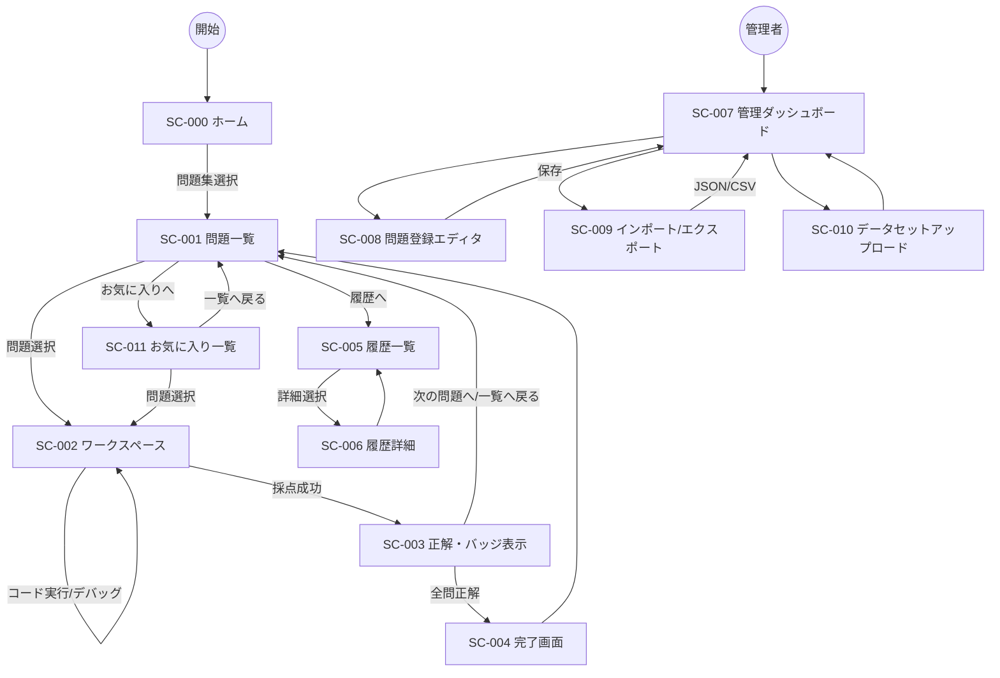

# UX-01 画面定義書（EXER 第一版）

## 1. ドキュメント情報

| 項目 | 内容 |
|------|------|
| **ID** | UX-01 |
| **プロジェクト名** | EXER |
| **関連ドキュメント** | REQ-01, REQ-02, ARC-01, UX-02, UX-03（プラグイン） |

本ドキュメントは枠組みの画面一覧・画面 ID（SC-000～SC-011）、画面遷移、各画面の役割・主要要素を定義する。**パンくず・ナビ**では、ワークブック ID `py-value` の表示名は **「Pythonデータ分析」** とする（REQ-01 用語定義）。**ワイヤーフレーム**は [wireframes/wireframes.html](wireframes/wireframes.html) をブラウザで開き、画面上部のタブで該当画面を選択して参照する。

---

## 2. 画面一覧と画面 ID

### 2.1 学習者向け

| 画面 ID | 画面名 | 概要 | 対応 UC |
|---------|--------|------|---------|
| **SC-000** | ホーム | ファーストビュー（画像なし・CSS/JS のみ）と問題集（ワークブック）選択。選択後は当該ワークブックの問題一覧へ遷移。 | UC-F10 |
| **SC-001** | 問題一覧 | ワークブック内の問題一覧。ソート（登録順・難易度・タイトル・お気に入り数）、タグフィルター、0 件時メッセージ、各カードにバッジ・タグ・お気に入りボタン・お気に入り数表示。 | UC-F01, UC-F11 |
| **SC-002** | ワークスペース（問題） | 問題ごとのプラグイン描画領域。下書き保存・解答送信・採点結果表示を含む。 | UC-F02, UC-F03, UC-F04, UC-F05 |
| **SC-003** | 正解・バッジ表示 | 採点成功時のフィードバック（ワークスペース内またはモーダル）。正解表示・バッジ付与。 | UC-F05, UC-F09 への導線 |
| **SC-004** | 完了画面 | ワークブック内の全問題に正解した状態で表示。一覧へ戻る等の導線。 | UC-F09 |
| **SC-005** | 履歴一覧 | 自分の解答履歴一覧（問題単位・直近 N 件）。 | UC-F06 |
| **SC-006** | 履歴詳細 | 単一の解答履歴の詳細（送信内容・正誤・日時等）。 | UC-F06 |
| **SC-011** | お気に入り一覧 | お気に入りした問題の一覧表示・挑戦・お気に入り解除。 | UC-F12 |

### 2.2 管理向け

| 画面 ID | 画面名 | 概要 | 対応 UC |
|---------|--------|------|---------|
| **SC-007** | 管理ダッシュボード | 簡易キー（?key=xxx）でアクセス。問題 CRUD・インポート/エクスポート・データセットへの導線。 | UC-F07, UC-F08 |
| **SC-008** | 問題登録エディタ | 問題の新規作成・編集・ステータス（下書き/公開）切り替え。 | UC-F07 |
| **SC-009** | インポート/エクスポート | 問題 JSON の一括インポート・エクスポート。データセットは参照のみ。 | UC-F08 |
| **SC-010** | データセットアップロード | CSV 等のデータセットをアップロードする画面。 | UC-F08, FR-F013 |

---

## 3. 画面遷移図

REQ-01 §10 を UX-01 の画面 ID で具体化する。

---

## 4. 各画面の説明

### SC-000 ホーム

- **役割**: ファーストビューで訴求したのち、登録済みワークブック（問題集）を選択し、当該問題一覧（SC-001）へ遷移する（FR-F023, FR-F024）。
- **主要 UI 要素**: ファーストビュー（CP-000、画像なし・CSS/JavaScript のみ）、問題集選択（CP-015）。ルート `/` で表示。パンくずの先頭は「ホーム」。
- **ルート**: `app/`（ルート `/`）。ARC-01-002 と整合。
- **ワイヤーフレーム**: 必要に応じて wireframes.html にタブ「SC-000 ホーム」を追加する。

### SC-001 問題一覧

- **役割**: 学習者がワークブック内の問題一覧・ステータス（バッジ・タグ・お気に入り数含む）を確認し、問題を選択してワークスペースへ遷移する。タグフィルター・お気に入り数ソートに対応（FR-F026, FR-F028）。
- **主要 UI 要素**: ソート切り替え（登録順・難易度・タイトル・お気に入り数）、タグフィルター（CP-016）、問題カード一覧（タイトル・難易度・バッジ・タグ・お気に入りボタン・お気に入り数）、0 件時のメッセージ、履歴・お気に入り一覧への導線。
- **ルート**: `app/[workbookId]/`（例: `/py-value`）。パンくずでは workbookId の表示名を用いる（例: 「Pythonデータ分析」）。ARC-01-002 と整合。
- **ワイヤーフレーム**: [wireframes/wireframes.html](wireframes/wireframes.html) を開き、タブ「SC-001 問題一覧」を選択した状態を参照。

### SC-002 ワークスペース（問題）

- **役割**: 問題の type に応じたプラグインの Renderer が描画する領域。下書き保存・解答送信・採点結果の即時表示を含む。
- **主要 UI 要素**: プラグイン描画領域（データ分析の場合は 3 ペイン、UX-03 参照）、下書き保存ボタン、解答送信ボタン、採点結果表示エリア。
- **ルート**: `app/[workbookId]/questions/[questionId]/` 等。
- **ワイヤーフレーム**: [wireframes/wireframes.html](wireframes/wireframes.html) を開き、タブ「SC-002 ワークスペース」を選択した状態を参照（データ分析プラグインの 3 ペイン構成は UX-03 で定義）。

### SC-003 正解・バッジ表示

- **役割**: 採点成功時に合格であることと、付与されたバッジを表示する。ワークスペース内のブロックまたはモーダルで表示。レイアウトは画面中央に配置する。
- **主要 UI 要素**: 合格メッセージ、バッジ表示、「次の問題へ」「一覧へ戻る」ボタン。全問正解時は完了画面（SC-004）への導線。
- **ワイヤーフレーム**: [wireframes/wireframes.html](wireframes/wireframes.html) のタブ「SC-003 正解・バッジ」を参照。

### SC-004 完了画面

- **役割**: ワークブック内の全問題に正解した状態で表示し、学習者に完了を伝える。レイアウトは画面中央に配置する。
- **主要 UI 要素**: 完了メッセージ、一覧へ戻るボタン。
- **ルート**: `app/[workbookId]/complete` 等。
- **ワイヤーフレーム**: [wireframes/wireframes.html](wireframes/wireframes.html) のタブ「SC-004 完了画面」を参照。

### SC-005 履歴一覧

- **役割**: 自分の解答履歴を問題単位で一覧表示する。直近 N 件（ワークブック設定に従う）。結果は「合格」「不合格」で表記する。
- **主要 UI 要素**: 履歴リスト（問題タイトル・結果・日時）、詳細へのリンク。
- **ワイヤーフレーム**: [wireframes/wireframes.html](wireframes/wireframes.html) のタブ「SC-005 履歴一覧」を参照。

### SC-006 履歴詳細

- **役割**: 単一の解答履歴の詳細（送信内容・結果・採点結果・日時）を表示する。結果は「合格」「不合格」で表記する。
- **主要 UI 要素**: 問題情報、userAnswer の要約、結果、judgedAt、一覧へ戻る。
- **ワイヤーフレーム**: [wireframes/wireframes.html](wireframes/wireframes.html) のタブ「SC-006 履歴詳細」を参照。

### SC-007 管理ダッシュボード

- **役割**: 問題 CRUD、インポート/エクスポート、データセットアップロードへの入口。URL クエリの簡易キーでアクセス制御。
- **主要 UI 要素**: 問題一覧（下書き含む）、新規作成、各行の操作として「編集」「削除」のリンクまたはボタン、インポート/エクスポート・データセットへのリンク。
- **ルート**: `app/admin/`（?key=xxx）。
- **ワイヤーフレーム**: [wireframes/wireframes.html](wireframes/wireframes.html) のタブ「SC-007 管理ダッシュボード」を参照。

### SC-008 問題登録エディタ

- **役割**: 問題の新規作成・編集。共通項目と type 別拡張（データ分析の場合は UX-03 で定義する項目）を編集。ステータス（下書き/公開）の切り替え。
- **主要 UI 要素**: フォーム（タイトル、type、難易度、解説、拡張フィールド）、ステータス切り替え、保存・キャンセル。
- **ワイヤーフレーム**: [wireframes/wireframes.html](wireframes/wireframes.html) のタブ「SC-008 問題登録エディタ」を参照。

### SC-009 インポート/エクスポート

- **役割**: 問題 JSON の一括インポート（1 件でもバリデーションエラーがあれば全体拒否）・エクスポート（全問題を 1 配列、データセットは参照のみ）。
- **主要 UI 要素**: ファイル選択（インポート）、エクスポート実行ボタン、結果メッセージ。
- **ワイヤーフレーム**: [wireframes/wireframes.html](wireframes/wireframes.html) のタブ「SC-009 インポート/エクスポート」を参照。

### SC-010 データセットアップロード

- **役割**: CSV 等のデータセットをアップロードする。問題データからファイル名・パスで参照する。
- **主要 UI 要素**: ファイルアップロード、アップロード結果表示。
- **ワイヤーフレーム**: [wireframes/wireframes.html](wireframes/wireframes.html) のタブ「SC-010 データセットアップロード」を参照。

### SC-011 お気に入り一覧

- **役割**: お気に入りした問題を一覧表示し、そこから問題に挑戦できる。お気に入り解除も可能（FR-F027, UC-F12）。
- **主要 UI 要素**: お気に入り一覧コンテナ（CP-018）、各問題カードに挑戦・お気に入り解除ボタン、一覧へ戻る。
- **ルート**: `app/[workbookId]/favorites`（例: `/py-value/favorites`）。パンくずは「ホーム > Pythonデータ分析 > お気に入り」等。
- **ワイヤーフレーム**: 必要に応じて wireframes.html にタブ「SC-011 お気に入り一覧」を追加する。

---

## 5. トレーサビリティ（本ドキュメントで定義する画面 ID と他ドキュメントの対応）

| 画面 ID | 対応する REQ-01 | 対応する UX-02 |
|---------|-----------------|----------------|
| SC-000 | UC-F10, FR-F023, FR-F024 | CP-000, CP-015 |
| SC-001 | UC-F01, UC-F11, FR-F003, FR-F025, FR-F026, FR-F028 | CP-002, CP-003, CP-004, CP-016, CP-017 |
| SC-002～SC-006 | UC-F02～F06, FR-F002 等 | CP-001, CP-007～CP-009 等 |
| SC-011 | UC-F12, FR-F027 | CP-017, CP-018 |
| SC-007～SC-010 | UC-F07, UC-F08 等 | CP-011～CP-014 |

---

## 6. 参照

- REQ-01 §10 画面・フロー、FR-F001～F028、UC-F01～F12
- ARC-01-002 ディレクトリ構造（app/ ルート、app/[workbookId]/、admin/）
- UX-02 コンポーネント（CP-xxx）、UX-03 データ分析プラグイン（ワークスペース内構成）
