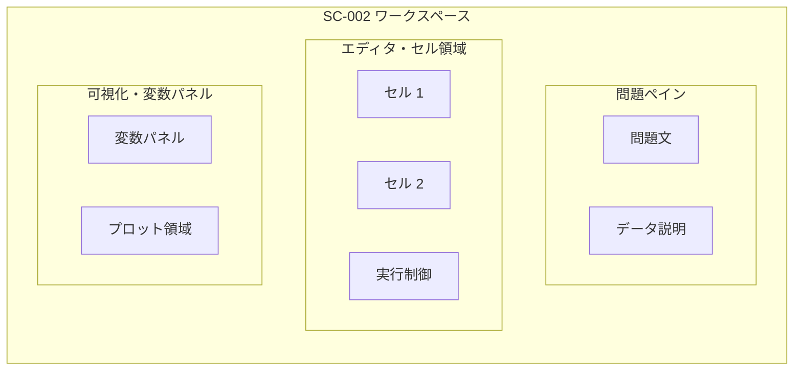

# UX-03 データ分析プラグイン 画面・コンポーネント

## 1. ドキュメント情報

| 項目 | 内容 |
|------|------|
| **ID** | UX-03 |
| **関連ドキュメント** | REQ-02（データ分析プラグイン）、ARC-02, UX-01（SC-002 ワークスペース）, UX-02, DATA-02 |

本ドキュメントはデータ分析プラグイン（type: `python-analysis`）の画面・コンポーネント構成を定義する。枠組みのワークスペース（SC-002）内に、本プラグインの 3 ペインおよび各エリアが描画される。ワイヤーフレームは [wireframes/](../wireframes/) のサブフォルダ（例: `plugins/python-analysis/`）から参照する。

---

## 2. 画面・エリアと枠との対応

データ分析プラグインは **SC-002 ワークスペース** 内に以下を描画する。

- **3 ペイン構成**（REQ-02 §7・§9）:
  - **左**: 問題ペイン（問題文・データ構造の説明）
  - **中央**: エディタ・セル領域（Monaco Editor、複数セル）
  - **右**: 可視化・ステータス・変数監視パネル（プロット領域＋変数パネル）

---

## 3. コンポーネント・エリア名

プラグイン内のエリアおよび主要 UI に名前を付与する。枠の CP-xxx とは別に、プラグイン内の識別用として利用する。

| エリア/コンポーネント名 | 役割 | 対応 UC |
|------------------------|------|---------|
| **問題ペイン** | 問題文（Markdown）、データセット説明等を表示。3 ペインの左側。 | UC-P01 |
| **エディタ・セル領域** | Monaco Editor によるコード入力。複数セルをサポート。Shift+Enter で実行（FR-P001）。 | UC-P02 |
| **セル** | 1 つのコード入力単位。採点時は全セルを結合して 1 スクリプトとして実行。 | UC-P02, UC-P05 |
| **実行制御** | 実行の中断（Interrupt）、カーネルリセット。タイムアウト 60 秒（FR-P005, FR-P006）。 | UC-P02 |
| **可視化・変数パネル** | 3 ペインの右側。プロット領域と変数パネルを含む。 | UC-P03, UC-P04 |
| **変数パネル** | 問題データで指定した変数名（例: ans, p_value）の現在値を表示（FR-P004）。 | UC-P04 |
| **プロット領域** | Matplotlib 等で生成された図表を DOM に投影（FR-P003）。 | UC-P03 |
| **採点結果表示** | 枠の CP-009 と連携。正誤・メッセージ・詳細（ML の場合は Accuracy 等、FR-P010）。 | UC-P05, UC-P06 |

---

## 4. レイアウト図（概念）

---

## 5. ワイヤーフレーム参照

- ワークスペース全体: [../wireframes/plugins/python-analysis/workspace.png](../wireframes/plugins/python-analysis/workspace.png)（用意次第で参照）
- 変数パネル・プロット領域の詳細: 同一サブフォルダ内に必要に応じて画像を追加し、本ドキュメントまたは UX-01 から参照する。

---

## 6. 参照

- REQ-02 §7 UI/UX、§9 画面・コンポーネント、FR-P001～P011、UC-P01～P06
- ARC-02 データ分析プラグイン構成（index.tsx, judge.ts）
- UX-01 SC-002 ワークスペース
- UX-02 共通コンポーネント・エラー表示（FR-P011）
- DATA-02 問題 JSON・watchVariables
